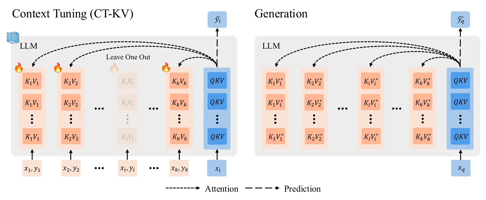

# Context Tuning

### [Paper](https://arxiv.org/pdf/2507.04221) | [Project Page](https://agenticlearning.ai/context-tuning/)

Public code release for the paper "Context Tuning for In-Context Optimization".



## Setup

Set up the Conda environment with `requirements.txt` to set up packages.
```
conda create --name contexttuning python=3.10
conda activate contexttuning
pip install -r requirements.txt
```

Download NLP-LR data (7.2GB).
```
conda install -c conda-forge git-lfs
git clone https://huggingface.co/datasets/allenai/metaicl-data
```

## Commands

Zero-Shot Prompting:
```
accelerate launch --mixed_precision bf16 train.py \
    --experiment_name zeroshot \
    --zero_shot \
    --eval_split 87
```

Standard In-Context Learning with 16 demonstrations pairs:
```
accelerate launch --mixed_precision bf16 train.py \
    --experiment_name icl \
    --eval_split 87
```

CT-KV with 16 demonstration pairs:
```
accelerate launch --mixed_precision bf16 train.py \
    --experiment_name ctkv \
    --epochs 200 \
    --eval_split 87
```

# Citation

If you have any questions or find any bugs, please feel free to contact Jack Lu (yl11330@nyu.edu).
If you found our work helpful, please cite it with the following BibTeX:
```
@misc{lu2025contexttuning,
      title={Context Tuning for In-Context Optimization},
      author={Jack Lu and Ryan Teehan and Zhenbang Yang and Mengye Ren},
      year={2025},
      eprint={2507.04221},
      archivePrefix={arXiv},
      primaryClass={cs.CL}
}
```