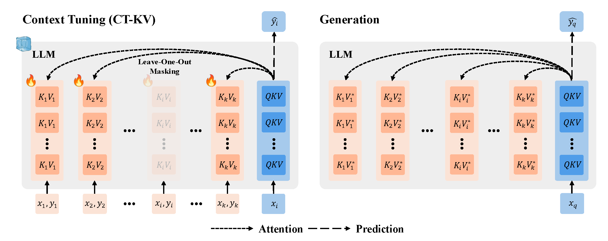

# Context Tuning

### [Paper](https://arxiv.org/pdf/2507.04221) | [Project Page](https://agenticlearning.ai/context-tuning/)

Public code release for the paper "Context Tuning for In-Context Optimization".

> **Website notice:** The `website` branch is deprecated and retained only for historical links. The canonical, maintained project page is [agenticlearning.ai/context-tuning](https://agenticlearning.ai/context-tuning/).



---

## Setup

Install [uv](https://docs.astral.sh/uv/getting-started/installation/), then create a Python 3.10 virtual environment and install the dependencies for CUDA 12.1.

```bash
uv venv --python 3.10
uv pip install --torch-backend cu121 -r requirements.txt
```

Download the NLP-LR data directly from Hugging Face.

```bash
uv run hf download allenai/metaicl-data \
    --repo-type dataset \
    --local-dir metaicl-data
```

---

## Commands

Zero-Shot Prompting:

```bash
uv run accelerate launch --mixed_precision bf16 train.py \
    --experiment_name zeroshot \
    --zero_shot \
    --eval_split 87

# output score: 0.3568
```


Standard In-Context Learning with 16 demonstration pairs:

```bash
uv run accelerate launch --mixed_precision bf16 train.py \
    --experiment_name icl \
    --eval_split 87

# output score: 0.3612
```

CT-KV with 16 demonstration pairs:

```bash
uv run accelerate launch --mixed_precision bf16 train.py \
    --experiment_name ctkv \
    --epochs 200 \
    --eval_split 87

# output score: 0.4470
```

---

## Citation

If you have any questions or find any bugs, please feel free to contact Jack Lu (yl11330@nyu.edu). If you found our work helpful, please consider giving us a ⭐ and citing us!

```bibtex
@inproceedings{lu2026contexttuning,
  title     = {Context Tuning for In-Context Optimization},
  author    = {Lu, Jack and Teehan, Ryan and Yang, Zhenbang and Ren, Mengye},
  booktitle = {International Conference on Machine Learning (ICML)},
  year      = {2026}
}
```
