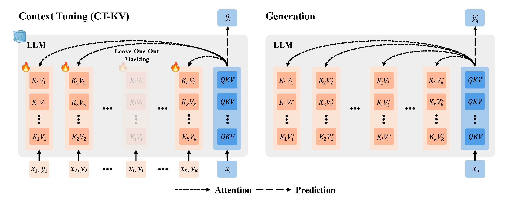

<h1 align="center">Context Tuning for In-Context Optimization</h1>

<p align="center">
  <a href="https://arxiv.org/abs/2507.04221"></a>
  <a href="https://agenticlearning.ai/context-tuning/"></a>
  <a href="https://jacklu-me.com/assets/pdf/icml2026-poster-context-tuning.pdf"></a>
  <a href="https://github.com/agentic-learning-ai-lab/context-tuning/blob/main/LICENSE"></a>
</p>

Official code for Context Tuning (ICML 2026), which adapts an LLM to a few-shot task without updating its weights by initializing a trainable memory representation from the demonstrations through in-context learning and refining it with gradient descent.



---

## Setup

Install [uv](https://docs.astral.sh/uv/getting-started/installation/), then create a Python 3.10 virtual environment and install the dependencies for CUDA 12.1.

```bash
uv venv --python 3.10
uv pip install --torch-backend cu121 -r requirements.txt
```

Download the NLP-LR data directly from Hugging Face.

```bash
uv run hf download allenai/metaicl-data \
    --repo-type dataset \
    --local-dir metaicl-data
```

---

## Commands

Zero-Shot Prompting:

```bash
uv run accelerate launch --mixed_precision bf16 train.py \
    --experiment_name zeroshot \
    --zero_shot \
    --eval_split 87

# output score: 0.3568
```


Standard In-Context Learning with 16 demonstration pairs:

```bash
uv run accelerate launch --mixed_precision bf16 train.py \
    --experiment_name icl \
    --eval_split 87

# output score: 0.3612
```

CT-KV with 16 demonstration pairs:

```bash
uv run accelerate launch --mixed_precision bf16 train.py \
    --experiment_name ctkv \
    --epochs 200 \
    --eval_split 87

# output score: 0.4470
```

---

## Citation

If you have any questions or find any bugs, please feel free to contact Jack Lu (yl11330@nyu.edu). If you found our work helpful, please consider giving us a ⭐ and citing us!

```bibtex
@inproceedings{lu2026contexttuning,
  title     = {Context Tuning for In-Context Optimization},
  author    = {Lu, Jack and Teehan, Ryan and Yang, Zhenbang and Ren, Mengye},
  booktitle = {International Conference on Machine Learning (ICML)},
  year      = {2026}
}
```
